# PagerZero: Zero-Wake On-Call

> Autonomous AI SRE pager replacement that **resolves routine outages silently** and secures **voice approval over the phone** for critical fixes — while engineers stay in bed.

🌐 **Live:** [pagerzero.pro](https://pagerzero.pro) · [Cloud Run (always-on)](https://pagerzero-309629300922.us-east1.run.app)  
🏆 Built for the [CALL-E: Your Code Is Calling](https://call-e.devpost.com/) Hackathon  
📄 Pitch deck: [Media/PagerZero_Autonomous_SRE.pdf](Media/PagerZero_Autonomous_SRE.pdf)

[](https://pagerzero.pro)
[](https://www.heycall-e.com/)
[](LICENSE)

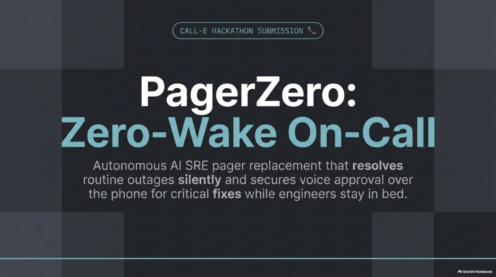

---

## The 3:00 AM Alert Fatigue Crisis

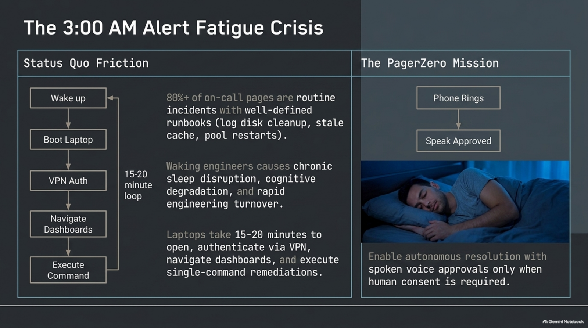

**Status quo:** wake up → boot laptop → VPN → dashboards → one runbook command. **15–20 minutes.**  
**80%+ of pages** are routine (log disk, stale cache, pool recycle). Waking people for those is how on-call burns out.

**PagerZero:** phone rings only when a human must consent. Speak **Approved**. Hang up.

---

## The Autonomous Escalation Funnel

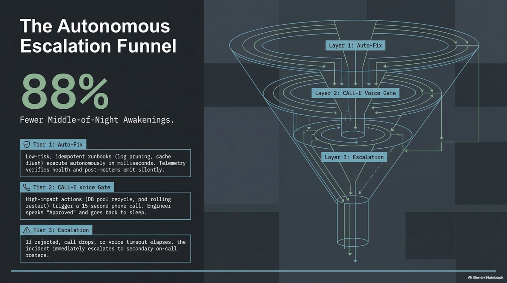

**88% fewer middle-of-the-night awakenings** (target for routine, runbook-backed alerts).

| Layer | When | What happens |
| :--- | :--- | :--- |
| **Tier 1 — Auto-fix** | Low-risk, idempotent runbooks | Disk prune, cache flush. Telemetry verify. Post-mortem. No call. |
| **Tier 2 — CALL-E voice gate** | High-impact (DB pool, rolling restart) | 15s phone brief. Spoken **Approved** → execute. |
| **Tier 3 — Escalate** | Reject, timeout, unknown runbook | Secondary on-call. |

---

## Reasoning vs. Voice

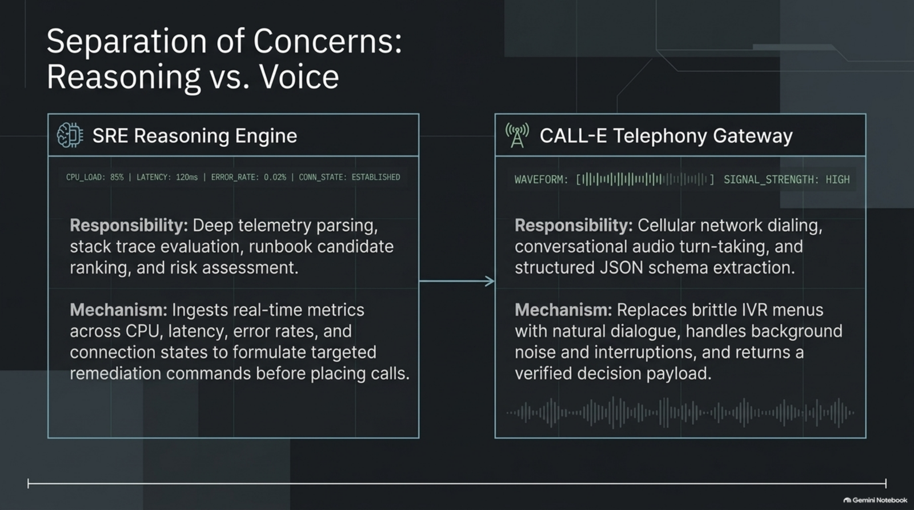

- **SRE reasoning engine** owns telemetry, runbooks, and risk. It decides *whether* to call and *what* to ask.
- **CALL-E** owns the phone: dial, turn-taking, structured JSON (`approval_status`). Not Twilio-style TwiML.

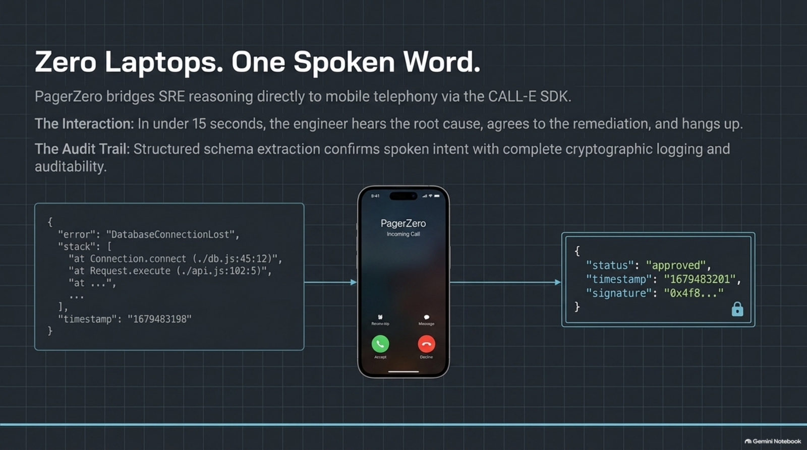

---

## Execution Loop (vs 28 min human delay)

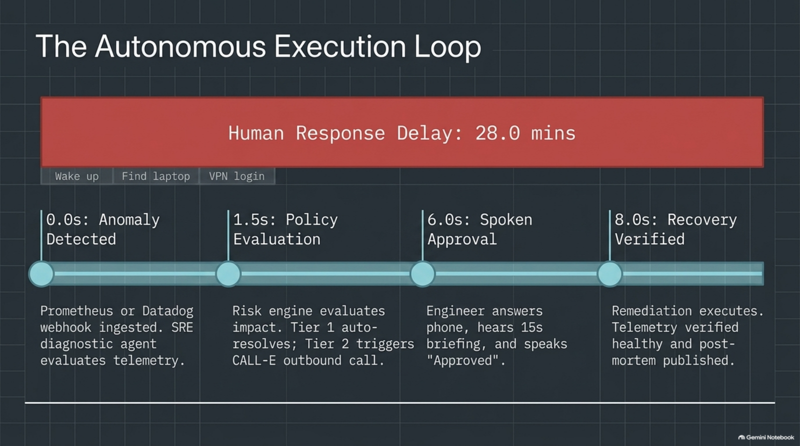

| Step | Time | What |
| :--- | :--- | :--- |
| Anomaly ingested | 0.0s | Alertmanager / Datadog / chaos webhook |
| Policy evaluation | ~1.5s | Tier 1 auto-resolves; Tier 2 plans CALL-E |
| Spoken approval | ~6s | Engineer hears the brief, says Approved |
| Recovery verified | ~8s | Fix runs; telemetry checked; post-mortem written |

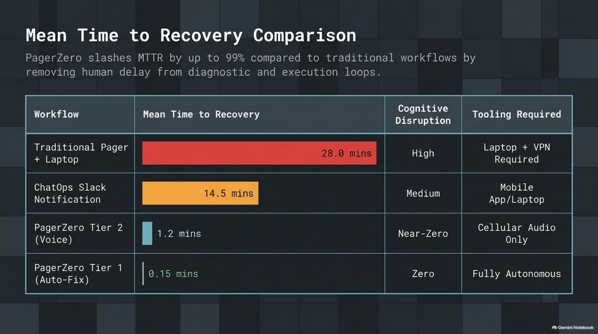

| Workflow | MTTR | Cognitive load | Tooling |
| :--- | :--- | :--- | :--- |
| Traditional pager + laptop | 28 min | High | Laptop + VPN |
| ChatOps Slack | 14.5 min | Medium | Phone + laptop |
| PagerZero Tier 2 (voice) | **1.2 min** | Near-zero | Cellular audio |
| PagerZero Tier 1 (auto) | **0.15 min** | Zero | None |

---

## Safety Guardrails

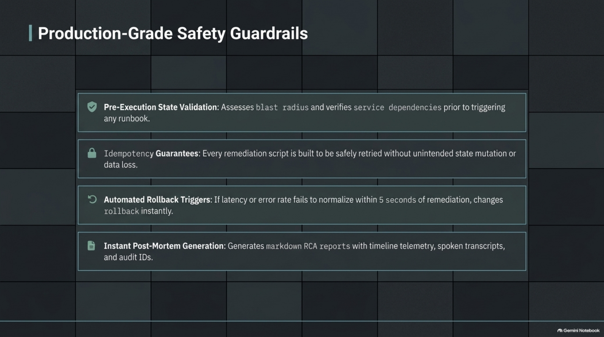

- Pre-execution blast-radius / dependency checks  
- Idempotent runbooks  
- Rollback if latency/error rate does not recover  
- Markdown post-mortem with timeline, transcript, and action IDs  

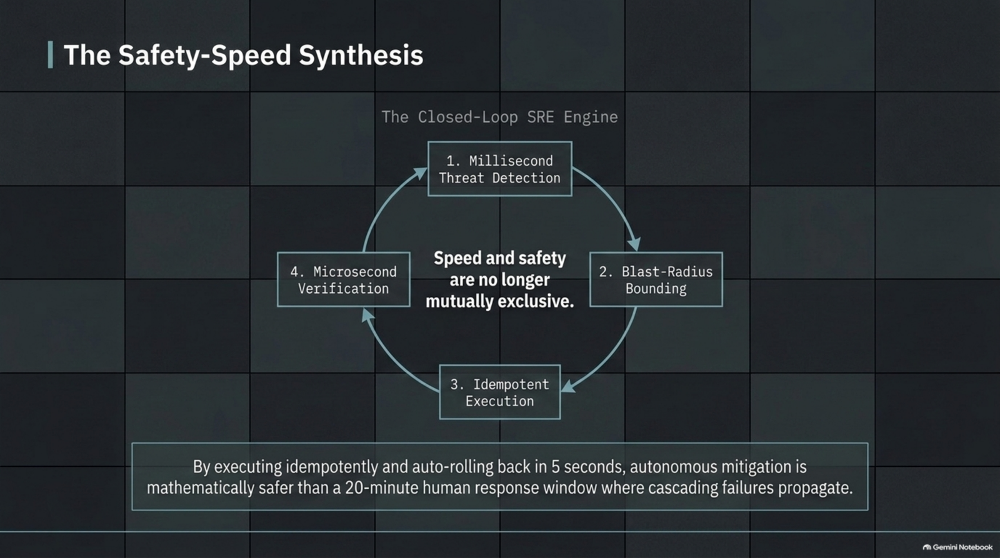

---

## Chaos Verification Matrix

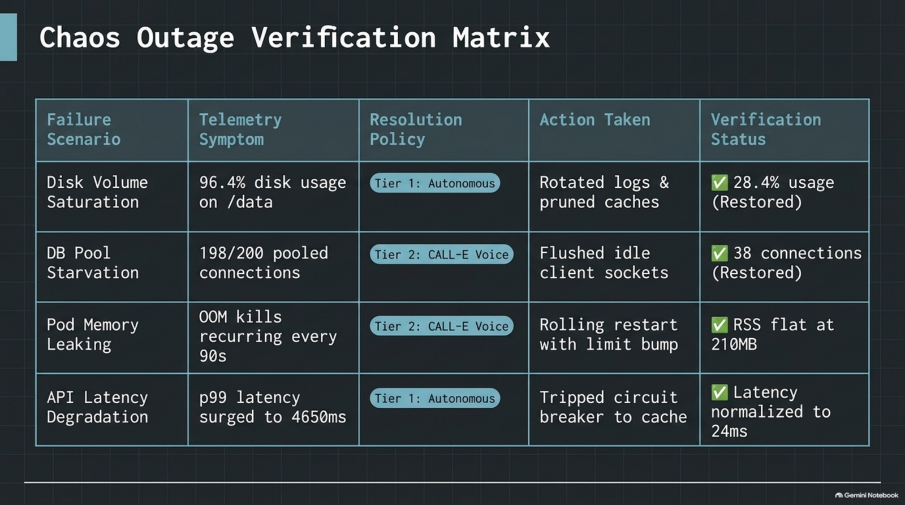

| Scenario | Symptom | Policy | Action | Verified |
| :--- | :--- | :--- | :--- | :--- |
| Disk volume saturation | 96.4% on logs | Tier 1 | Logrotate / prune | 28.4% |
| DB pool starvation | 198/200 conns | Tier 2 voice | Recycle pool | 38 conns |
| Auth pod OOM | RSS 97% | Tier 2 voice | Rolling restart | healthy |
| Redis memory | 94.8% | Tier 1 | Flush expired keys | ~42% |
| Upstream 502 | error rate 42% | Tier 2 voice | Circuit breaker | queued |

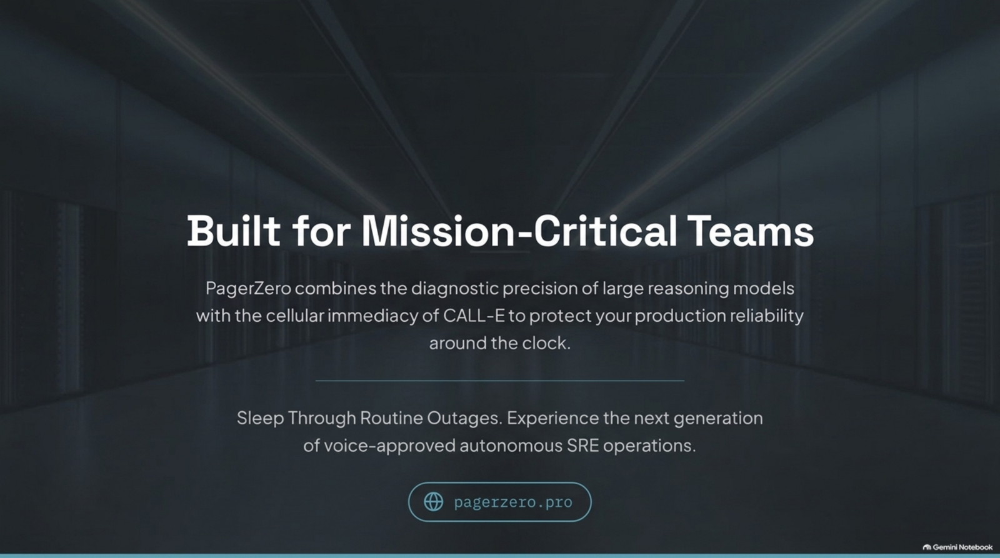

---

## Architecture

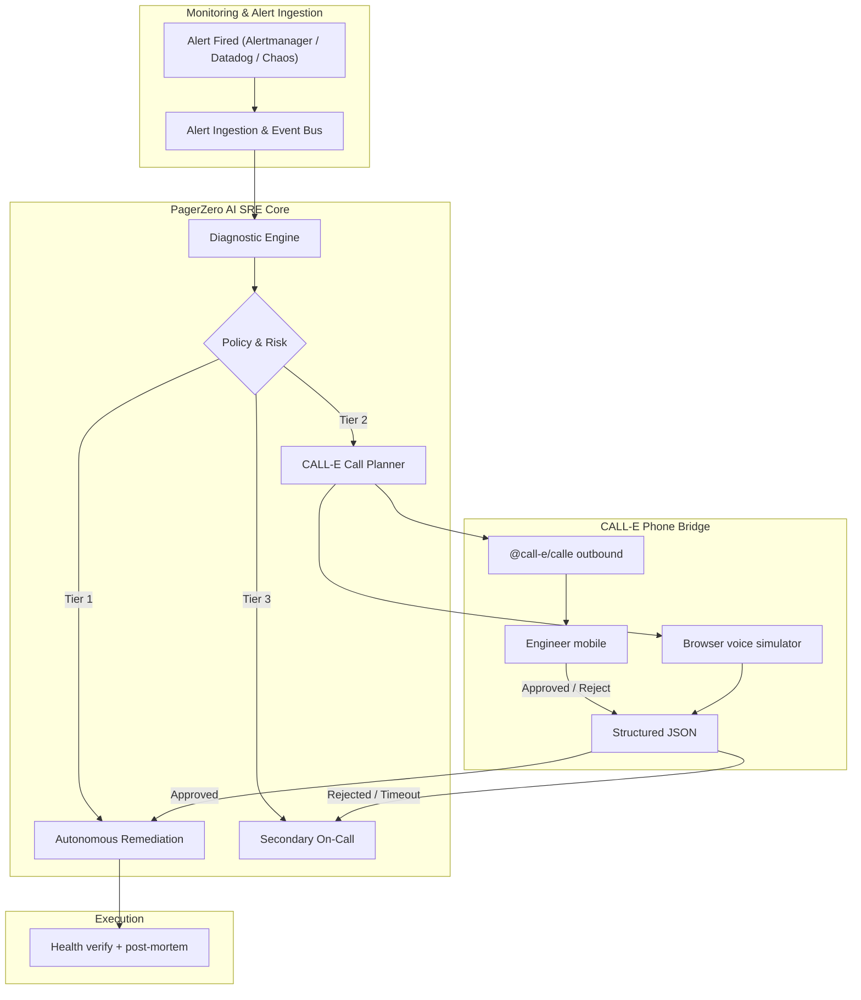

---

## Quick start

```bash
git clone https://github.com/adamm285-dev/pagerzeropro.git
cd pagerzeropro
npm install
npm --prefix client install
npm run build
npm start
```

Open [http://localhost:4000](http://localhost:4000). Dev with HMR: `npm run dev`. Tests: `npm test`.

### Live CALL-E (optional)

Copy `.env.example` → `.env`. Set `CALLE_API_KEY` from [dashboard.heycall-e.com](https://dashboard.heycall-e.com/account/api-keys) and `ON_CALL_PHONE` in E.164. Without a key, the **voice simulator** is used (no credits).

Webhook for real monitors:

```text
POST https://pagerzero.pro/api/alerts/webhook
```

Alertmanager `{ "alerts": [ ... ] }` payloads are accepted. Map `labels.service` to `payments-api`, `auth-service`, `log-ingestion-worker`, `cache-redis-03`, or `checkout-gateway`.

---

## Deploy

**Always-on (judges):** [Cloud Run](https://pagerzero-309629300922.us-east1.run.app) — `min-instances=1`.

**Docker:** `docker compose up -d --build` (Caddy TLS if DNS points at a VM).

---

## License

MIT © 2026 PagerZero.
