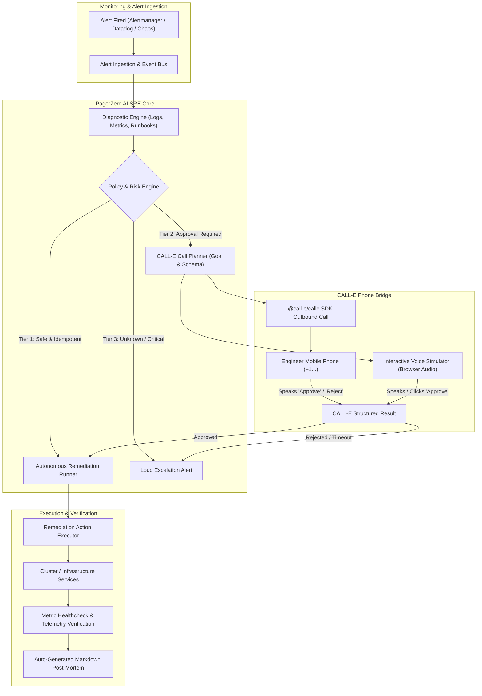

# 🚨 PagerZero: Autonomous Voice-Approved Incident Remediation

> **"Stay in bed while your AI agent investigates, fixes, or calls for one-word approval."**  
> *Built for the [CALL-E: Your Code Is Calling](https://call-e.devpost.com/) Hackathon.*

[](https://www.heycall-e.com/)
[](LICENSE)
[](https://www.typescriptlang.org/)
[](https://reactjs.org/)
[](https://tailwindcss.com/)

---

## 🛌 The Problem: 3 AM On-Call Burnout

Every software engineer and SRE dreads the 3:00 AM PagerDuty siren:
1. You are jolted awake from deep sleep.
2. You crawl out of bed, open your bright laptop in the dark, squint at dashboards.
3. You run a well-known runbook command (e.g. restart a hung pod, clear a full `/var/log` buffer, recycle an exhausted database connection pool).
4. You wait 5 minutes to verify metrics recover, close the laptop, and try to fall back asleep (ruined sleep cycle).

**70% to 80% of routine alerts can either be resolved autonomously or approved with a simple 10-second spoken confirmation.**

---

## ⚡ The Solution: PagerZero

**PagerZero** is an intelligent on-call agent and pager replacement powered by **CALL-E**:

- **Autonomous SRE Reasoning**: Ingests alerts from Prometheus, Datadog, CloudWatch, or webhooks, diagnoses root causes, and identifies verified runbook actions.
- **Tier 1 (Safe Policy Auto-Remediation)**: For low-risk, idempotent runbooks (e.g. prune expired cache keys, compress full log partitions), PagerZero executes the remediation autonomously, verifies healthchecks clear, and records a post-mortem. **The on-call engineer sleeps undisturbed.**
- **Tier 2 (CALL-E Voice Approval — Stay in Bed)**: For high-impact fixes (e.g. database connection pool recycle, cluster node scale, replica failover), PagerZero dials the engineer's mobile phone via CALL-E. The agent provides a concise 15-second voice brief:
  > *"Hi Adam, PagerZero here. Payments API DB connection pool is 98% saturated due to 4 hung queries. I can terminate the hung queries and recycle the pool now. Do you approve?"*
  
  The engineer speaks into their phone half-asleep: **"Approved."**  
  CALL-E extracts the decision as structured JSON, PagerZero executes the fix immediately, verifies telemetry recovery, and signs off: *"Action completed. Go back to sleep!"*
- **Tier 3 (Emergency Escalation)**: If an issue is unknown, rejected, or unreachable, PagerZero triggers full emergency secondary escalation.
- **Dual Calling Engine**: Works with live mobile phone numbers via `@call-e/calle` SDK or using the built-in browser **Interactive Voice Simulator** (synthesized speech + mic speech recognition) for instant zero-credit demonstrations.

---

## 🏗️ Architecture



---

## 🚀 Quick Start

### 1. Prerequisites
- Node.js (v18+)
- npm (or pnpm)

### 2. Installation
```bash
git clone https://github.com/your-repo/PagerZero.git
cd PagerZero
npm install
npm --prefix client install
```

### 3. Build & Run
```bash
# Build server and client
npm run build

# Start the full-stack application
npm start
```
Open **[http://localhost:4000](http://localhost:4000)** in your browser!

For live development with hot module reloading:
```bash
npm run dev
```

---

## ⚙️ Configuration & Live CALL-E Dialing

1. Copy `.env.example` to `.env`:
   ```bash
   cp .env.example .env
   ```
2. Configure your credentials:
   ```env
   CALLE_API_KEY=calle_your_api_key_here
   CALLE_BASE_URL=https://api.heycall-e.com
   ON_CALL_NAME=Adam (Primary SRE)
   ON_CALL_PHONE=+15551234567
   PORT=4000
   ```
3. You can also configure the API key, phone number, and toggle between **Live Call** and **Voice Simulator** directly in the UI via the **Settings (⚙️)** modal.

---

## 💥 Chaos Scenarios Included

Test the system in real time using the built-in Chaos Outage Simulator bar:

| Scenario | Service | Policy Tier | Outcome |
| :--- | :--- | :--- | :--- |
| **Disk 96% Full** | `log-ingestion-worker` | **Tier 1 (Auto-Fix)** | Prunes archived logs autonomously. **Engineer stays in bed.** |
| **DB Pool Saturated** | `payments-api` | **Tier 2 (Voice Approval)** | CALL-E calls mobile phone. Engineer speaks *"Approve"*. Pool recycled. |
| **Redis Memory Saturation** | `cache-redis-03` | **Tier 1 (Auto-Fix)** | Safely flushes expired TTL keys without waking engineer. |
| **Auth Pod Impending OOM** | `auth-service` | **Tier 2 (Voice Approval)** | CALL-E rings for approval to perform a rolling pod restart. |
| **Checkout Gateway 502** | `checkout-gateway` | **Tier 2 (Voice Approval)** | Rings engineer to activate circuit breaker queue fallback. |

---

## 🧪 Automated Tests

Run the complete Vitest test suite covering SRE diagnostics, cluster remediation, and autonomous lifecycle:
```bash
npm test
```

---

## 📄 License
MIT © 2026 PagerZero Contributors.
